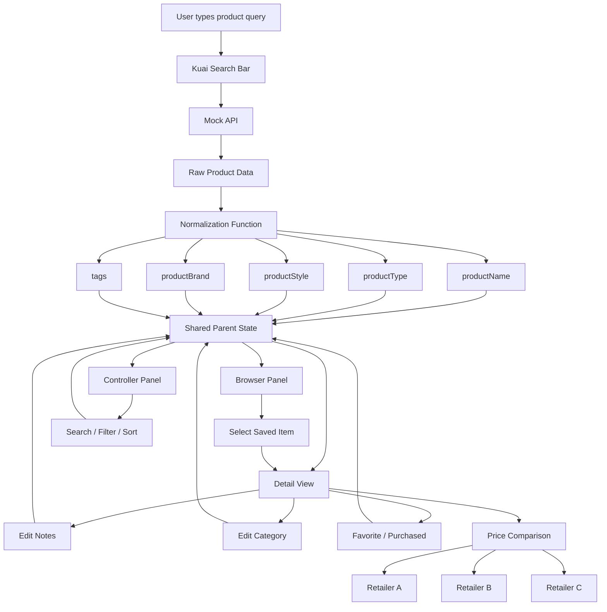

# Kuai — System Flow Diagram

```mermaid
flowchart TD
    A["User types product query"] --> B["Kuai Search Bar"]
    B --> C["Mock API"]
    C --> D["Raw Product Data"]
    D --> E["Normalization Function"]
    E --> F1["productName"]
    E --> F2["productType"]
    E --> F3["productStyle"]
    E --> F4["productBrand"]
    E --> F5["tags"]
    F1 --> G["Shared Parent State"]
    F2 --> G
    F3 --> G
    F4 --> G
    F5 --> G
    G --> H["Browser Panel"]
    G --> I["Detail View"]
    G --> J["Controller Panel"]
    H --> K["Select Saved Item"]
    K --> I
    J --> L["Search / Filter / Sort"]
    L --> G
    I --> M["Edit Notes"]
    I --> N["Edit Category"]
    I --> O["Favorite / Purchased"]
    I --> P["Price Comparison"]
    P --> P1["Retailer A"]
    P --> P2["Retailer B"]
    P --> P3["Retailer C"]
    M --> G
    N --> G
    O --> G
```
