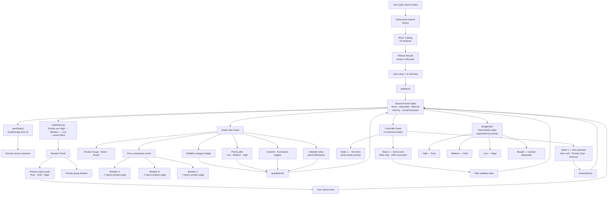

## System Flow

```mermaid
flowchart TD
    A["User types search query"] --> B["Debounced Search\n200ms"]
    B --> C["Mock Catalog\n20 products"]
    C --> D["Filtered Results\nshown in Browser"]
    D --> E["User clicks + to add item"]
    E --> F["addItem()"]
    F --> G["Shared Parent State\nitems · selectedId · filterCat\nfavOnly · showPurchased"]
    G --> S["saveState()\nlocalStorage kuai-v2"]
    S --> S1["Persists across sessions"]
    G --> H["visibleItems()\nPriority sort High → Medium → Low\n+ active filters"]
    H --> BP["Browser Panel"]
    BP --> BP1["Priority-coded cards\nRust · Gold · Sage"]
    BP --> BP2["Priority group dividers"]
    BP1 --> SEL["User selects item"]
    SEL --> G
    G --> DV["Detail View Panel"]
    DV --> DV1["Product image · Name · Brand"]
    DV --> DV2["Editable category badge"]
    DV --> DV3["Price comparison cards"]
    DV3 --> R1["Retailer A\n↗ opens product page"]
    DV3 --> R2["Retailer B\n↗ opens product page"]
    DV3 --> R3["Retailer C\n↗ opens product page"]
    DV --> DV4["Priority pills\nLow · Medium · High"]
    DV --> DV5["Favorite · Purchased toggles"]
    DV --> DV6["Editable notes\npencil affordance"]
    DV2 --> UPD["updateItem()"]
    DV4 --> UPD
    DV5 --> UPD
    DV6 --> UPD
    UPD --> G
    G --> CP["Controller Panel\n3 contextual states"]
    CP --> CS1["State 1 — No items\nQuiet empty prompt"]
    CP --> CS2["State 2 — Items exist\nStats strip · Filter accordion"]
    CP --> CS3["State 3 — Item selected\nItem card · Priority chips · Remove"]
    CS2 --> F2["Filter updates state"]
    CS3 --> RM["removeItem()"]
    F2 --> G
    RM --> G
    G --> BUD["Budget Bar\nTotal wishlist value\nsegmented by priority"]
    BUD --> BUD1["High — Rust"]
    BUD --> BUD2["Medium — Gold"]
    BUD --> BUD3["Low — Sage"]
    BUD --> BUD4["Bought — tracked separately"]
```
