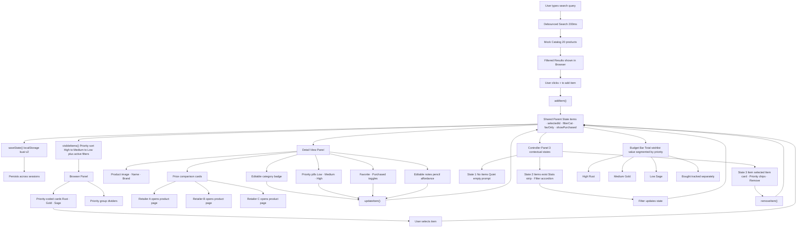

# Kuai

## Design Intent Document

## Project Overview
Kuai is a centralized shopping companion where users can collect, organize, compare, and manage products they want — all in one place. Instead of saving desired items across multiple tabs, screenshots, notes apps, shopping carts, and social media bookmarks, Kuai creates a single structured system for keeping track of what matters.

The product is built as a three-panel interface: a **Browser** for scanning and searching the saved collection, a **Detail View** for inspecting one selected item and making decisions about it, and a **Controller** for filtering, managing, and understanding the collection as a whole. This structure allows Kuai to behave like a real product system rather than a static page.

Kuai should feel purposeful, organized, and visually calm. It is not meant to behave like a shopping cart or checkout flow. Its role is to help users remember what they want, compare prices across retailers, prioritize what matters most, and make better buying decisions over time.

---

## Brand and Product Identity
Kuai is a shopping-planning companion designed to make saving, organizing, and comparing desired products feel calm, intentional, and visually refined.

The name **Kuai** references "sale" in Hawaiian, giving the product an immediate connection to shopping, discovery, and saved wants. Rather than feeling like a cart, a price tracker, or a cluttered shopping dashboard, Kuai should feel like a thoughtfully curated personal space for products the user wants to remember, revisit, and decide on.

### Brand Personality
- Stress-free
- Minimal
- Clutter-free
- Clean
- Chic

### Emotional Tone
- Minimal and chic
- Calm and stress-free
- Practical without feeling cold
- Elegant without feeling overly luxurious

### Brand Words
- Chic
- Minimal
- Classy
- Stress-free
- Practical and efficient

### Brand Principle
Kuai should feel like a quiet, curated shopping companion — not a loud retail interface.

### Tagline
**Save it. Compare it. Buy it right.**

---

## Domain and Reason for Choosing It
Kuai sits in a **consumer-productivity / shopping-organization** domain. It combines the emotional appeal of shopping and aspiration with the structural logic of an organizational tool.

This domain is a strong fit for the project because it naturally supports the required three-panel architecture:

- Users need a place to browse a collection of items
- They need a place to inspect one chosen item in detail
- They need a place to control how the collection is viewed and managed

That makes it an ideal system for demonstrating lifted state, single source of truth, and cross-panel interaction. It is also a smart design choice because it feels relevant and portfolio-worthy — it can be styled as a real product, but its structure remains clear enough to demonstrate the underlying architecture.

---

## Core Problem and User Need
The core problem is **fragmentation**.

People often save desired products in too many disconnected places: open tabs, Instagram saves, screenshots, browser bookmarks, shopping carts, text messages, and notes apps. These methods are messy, temporary, and hard to manage. As a result, users lose track of what they saved, forget why they wanted something, and have no clean way to sort, prioritize, compare prices, or revisit saved items intentionally.

The user need is not just "a place to save products." The deeper need is:

- One reliable location for saved wants
- A structured way to review and compare items later
- A way to prioritize, track, and act on saved products
- A calmer and more intentional experience than scattered digital clutter

Kuai answers that need by turning saved products into an organized visual system. It helps the user move from casual saving to active, informed decision-making.

---

## Target User
Kuai is designed primarily for people who shop online often and want a better way to keep track of what they are interested in.

### Primary Users
- Frequent online shoppers
- People managing household and personal shopping across multiple categories
- Users who save products often and want a cleaner, more organized way to act on them

### Primary Persona
**Lisa** — a 36-year-old mother of three who manages overlapping shopping lists across categories: household items, gifts, personal wants, and seasonal purchases. She experiences product overload and decision fatigue, shops under time pressure, and needs a calm, structured way to compare and organize saved items without mental clutter.

### Online Behavior
- Shops online frequently across multiple retailers
- Saves items across many disconnected places
- Revisits products before deciding what to purchase
- Values convenience, clarity, and visual order

Kuai is for users who want a stress-free system that makes saved products easier to browse, understand, prioritize, and buy at the right price.

---

## Core Design Goals

### Functional Goals
- Create one clear place where all saved items live
- Make saved items easy to browse, scan, and revisit
- Allow users to quickly inspect any selected item in detail
- Surface real price comparisons across retailers so users can find the best deal
- Give users simple controls to filter, prioritize, and manage items
- Make state changes visible across the entire system so the interface feels connected and trustworthy
- Persist the collection across sessions so the product behaves like a real tool

### Experience Goals
- Reduce the mental clutter of scattered saved items
- Make the product feel calm, intentional, and visually ordered
- Give users a feeling of control over their wants and priorities
- Make the experience feel like a thoughtful product, not a generic list manager
- Balance usefulness with a refined visual sensibility

### Design Principle
The product should feel like a curated decision space — not a chaotic storage bin.

---

## Visual Direction
The visual direction of Kuai supports the feeling of a calm, curated, and efficient product system. The interface is visually restrained, easy to scan, and elegant without becoming decorative.

### Visual Mood
Kuai should feel:
- Purposeful
- Organized
- Visually calm
- Minimal
- Chic
- Uncluttered

### Color Palette
The palette uses **warm muted neutrals** — cream, parchment, taupe, sage, and gold — applied through a full CSS custom property token system that supports both light and dark modes.

It avoids:
- Loud saturation
- Aggressive retail red or sale language
- Cold enterprise dashboard styling

Priority is communicated through a consistent three-color system: rust-red for High, gold for Medium, sage-green for Low. This color language runs through item cards, badges, priority buttons, the budget bar, and the Controller Panel — making urgency readable at a glance.

### Typography
Kuai uses a single-family type system: **Nunito Sans** at weights 800–900 for display and headings, 600–700 for UI labels, and 400 for body copy. Weight alone carries the entire typographic hierarchy — no mixed families. This keeps the interface fast to read and appropriate for a task-oriented shopping tool.

### Spacing and Composition
The layout uses:
- Clear text hierarchy
- Consistent spacing
- Calm composition
- Readable grouping of information
- Enough breathing room to reduce clutter

### Shape Language and UI Feel
- Soft card edges, not sharp enterprise UI
- Image-led Detail View layout
- Restrained utility controls in the Controller
- Polished but minimal component styling

### Visual Principle
Kuai should look like a curated product environment — not a generic shopping dashboard.

---

## Layout Specifications
Kuai uses a desktop-first three-panel layout that clearly reflects the architecture of the system, with full responsive support across TV/large, tablet, and mobile breakpoints.

### Panel Layout (Desktop)
- **Browser / Collection:** 25%
- **Detail View:** 55%
- **Controller:** 20%

The Detail View is the dominant panel because it is where users compare prices, set priority, add notes, and make purchasing decisions. The layout is designed to reflect that logic — not distribute space equally.

### Responsive Behavior

| Breakpoint | Layout |
|---|---|
| 1440px+ (TV / large) | All three panels scale up proportionally |
| 768–1199px (tablet) | Browser + Detail View visible; Controller slides in via FAB |
| Under 768px (mobile) | Single active panel with bottom tab navigation |

### Layout Hierarchy
- The Browser supports scanning, searching, and quick selection
- The Detail View acts as the main decision and action space
- The Controller remains compact and utility-driven, contextually revealing controls based on user state

### Layout Principle
The page should feel balanced, calm, and deliberate — with the Detail View carrying the most visual weight.

---

## System Architecture
Kuai follows a **Browser → Detail View → Controller** three-panel architecture built as a single standalone HTML file with vanilla JavaScript.

State lives in **one shared object** and all panels read from and write to that single source. No panel stores its own duplicate copy of the same data.

### Browser Panel
The Browser is the collection panel. Its role is to let the user search the catalog, scan saved items, and select one for detailed review.

It:
- Displays a real-time debounced catalog search with results the user can add to their collection
- Renders the saved collection, organized permanently by priority (High → Medium → Low) with color-coded cards
- Shows priority group dividers so urgency distribution is readable at a glance
- Visually indicates the currently selected item
- Displays search hint chips to guide new users

### Detail View Panel
The Detail View is the decision space. Its role is to show rich information about the selected item and let the user act on it.

It:
- Displays the product image, name, brand, and editable category
- Shows real price comparisons across retailers with the best price highlighted — cards with verified retailer URLs open directly to the product page in a new tab
- Displays a savings callout showing the delta between highest and lowest price
- Provides inline priority selection (Low / Medium / High)
- Supports Favorite and Mark Purchased toggles with state reflected across all panels
- Provides inline notes editing via a pencil icon affordance

### Controller Panel
The Controller is the management panel. Its role is to surface relevant controls based on what the user is currently doing — not all controls at all times.

It uses a three-state contextual model:
- **State 1 (no items):** Quiet empty prompt only
- **State 2 (items exist, nothing selected):** Stats strip + Filter and Sort accordions
- **State 3 (item selected):** Stats strip + selected item card + priority chips + remove button + Filter accordion

It also displays a **Budget Bar** — a segmented bar showing the total wishlist value broken down by priority, with purchased items tracked separately.

### Architectural Rule
There is one single source of truth. All state lives in one shared `state` object. Panels read from it and write to it through direct function calls. No duplicated state anywhere in the system.

---

## Shared State and Data Model
The shared state is the backbone of Kuai. The Browser, Detail View, and Controller stay synchronized through one single source of truth — a flat `state` object that owns the entire collection and all UI state.

### State Object
```javascript
let state = {
  items:         [],          // full saved collection
  selectedId:    null,        // currently selected item ID
  search:        '',          // active search query
  filterCat:     'All',       // active category filter
  favOnly:       false,       // favorites-only toggle
  showPurchased: false,       // show purchased items toggle
  notesEditing:  false,       // notes edit mode flag
};
```

### Item Schema
Each saved item in `state.items` follows this structure:

```javascript
{
  id:              'item-1745000000000',
  name:            'Sony WH-1000XM5 Headphones',
  brand:           'Sony',
  category:        'Tech',
  price:           248,
  image:           'https://...',
  priceComparison: [
    { retailer: 'Sony',     price: 399, url: 'https://...' },
    { retailer: 'Best Buy', price: 298, url: 'https://...' },
    { retailer: 'Amazon',   price: 248, url: 'https://...' },
  ],
  notes:       '',
  priority:    'medium',    // 'low' | 'medium' | 'high'
  favorite:    false,
  purchased:   false,
  dateAdded:   '2026-04-29T14:00:00.000Z',
}
```

### Persistence
State is persisted to `localStorage` under the key `kuai-v2` on every mutation. On page load, saved state is restored before the first render so the collection, selected item, filter settings, and preferences survive across sessions.

---

## Catalog
Kuai ships with a built-in catalog of 20 products across five categories — Tech, Beauty, Clothing, Home, and Toys — with real price comparison data verified against live retailer listings as of April 2026.

Products with verified retailer URLs allow users to click directly through to the product page from the Detail View's price comparison cards.

### Products with Live Retailer Links
- Sony WH-1000XM5 Headphones — Sony, Best Buy, Amazon
- Le Labo Santal 33 Perfume — Le Labo, Nordstrom
- Patagonia Nano Puff Jacket — Patagonia, REI, Backcountry
- LEGO Wildflower Bouquet — LEGO, Target, Amazon
- Kindle Paperwhite 16GB (2024) — Amazon, Best Buy, Target

---

## Live URL
[https://niharika12002.github.io/ReactiveSandboxKuai/kuai.html](https://niharika12002.github.io/ReactiveSandboxKuai/kuai.html)

---

## System Flow Diagram



---

## Five Questions

---

**1. Can I defend this?**

Yes. Every major decision has a reason behind it. The single shared state keeps all three panels in sync — that's not just an architectural choice, it's what makes the product feel connected. The 25/55/20 proportions exist because the Detail View is where decisions happen, so it earns the most space. The warm palette exists because Kuai is supposed to reduce stress, not drive urgency. The priority-coded cards exist because users should be able to scan the list and understand urgency without reading a single label. I can explain all of it.

---

**2. Is this mine?**

Yes. AI built what I directed, but the product decisions are mine. I pushed Kuai beyond being a wishlist. I defined the visual identity. I corrected the panel proportions. I replaced the serif font when it was making Kuai feel like a magazine instead of a tool. I removed the custom item modal when it was technically complete but wrong for the product. I rejected the alternate codebase when it violated the architecture. The Record of Resistance documents sixteen moments where I redirected the work. AI executed. I decided.

---

**3. Did I verify?**

Yes, by actually using it. I caught six interaction failures through live testing that were invisible in the code — duplicate ticks, cards animating in bulk when only one changed, the purchased toggle defaulting to green despite the state being false. I also caught a localStorage bug where stale persisted data was overriding the intended default, and fixed it by bumping the storage key. I didn't just ship it. I used it.

---

**4. Would I teach this?**

Yes. Kuai is a clean example of props-down/events-up. The parent owns the state. Each panel gets what it needs through props. Actions come back up through callbacks. Nothing is duplicated. I'd also use the Controller Panel to teach contextual UI — showing the right thing at the right moment is a higher standard than showing everything always. Both are ideas I understand well enough to explain clearly.

---

**5. Is my documentation honest?**

Yes. The Direction Log shows how AI shaped the product. The Record of Resistance shows where I pushed back. This reflection doesn't overstate my role or understate AI's. AI was genuinely useful — it built the system, implemented the logic, wrote documentation drafts, and executed code patches throughout. But it did all of that under direction. The decisions about what Kuai should be and what it should refuse to become were mine.

---

# AI Direction Log

**Project:** Kuai — A Calm, Structured Shopping Planning Companion
**Course:** AI 201: Creative Computing with AI
**AI Tools Used:** ChatGPT (product framing, concept development), Claude (system design, implementation, build)
**Role Assigned to AI:** Lead Art Director and Creative Design Engineer

---

## Overview

This log documents the six most significant moments where AI was used to shape Kuai — as a product, a system, a visual identity, and a working interface. These entries represent the decisions that most fundamentally defined what Kuai became. Every major decision was made by the designer. AI executed, challenged, and documented under that direction.

---

## Phase 1 — Concept Development and Product Framing
*Conducted in ChatGPT*

---

### Entry 1 — Adding Price Comparison as a Core Product Feature

**Goal:**
Strengthen Kuai's value beyond organization and storage.

**How AI was used:**
AI helped convert the idea of retailer comparison into a documented product feature and a design requirement for the Detail View. It was used to define how price comparison should be displayed and how it should support the user's decision process.

**What was designed:**
Each saved item could show prices across two or three retailers. The lowest price would be highlighted, and a savings callout would show the delta. Example retailers in the mock data: Sony, Best Buy, Amazon, Walmart.

**What changed:**
This was a major leap in the project. Kuai became a tool for making better purchasing decisions, not just remembering products. The entire tagline — "Save it. Compare it. Buy it right." — was made possible by this decision.

---

### Entry 2 — Evolving Kuai into a Structured Product Intelligence System

**Goal:**
Move Kuai away from a manually managed list toward a more intelligent, data-driven system.

**How AI was used:**
AI helped interpret professor feedback and reframe the product's architecture around structured product data. It helped define a new flow:

1. User adds an item
2. Kuai receives raw product data
3. Raw data is normalized into a clean schema
4. The normalized product is stored
5. The app searches and filters on structured fields

**The product schema that emerged:**
- `productName`, `productType`, `productStyle`, `productBrand`, `tags`
- `id`, `image`, `notes`, `favorite`, `purchased`, `priceComparison` (UI-support fields)

**What changed:**
This is where Kuai stopped behaving like a list app and started behaving like a structured product intelligence system. It made the app smarter, more searchable, and more aligned with the professor's guidance.

---

## Phase 2 — System Design and Implementation
*Conducted in Claude*

---

### Entry 3 — Initial Build: Three-Panel React SPA

**Prompt direction given:**
AI was given the Design Intent Document and instructed to build Kuai as Lead Art Director and Creative Design Engineer. The brief specified:
- Three-panel layout at exact proportions 25 / 55 / 20
- Warm editorial palette: cream, parchment, taupe, sage, espresso, gold — intentionally anti-retail
- Single source of truth architecture — all state in one parent, props down, events up
- No backend, no live API, no external services — mock data only per course brief

**What AI produced:**
A fully functional SPA with the three-panel layout at specified proportions, Playfair Display and DM Sans typography, a mock catalog with 10+ items, and all panels connected via lifted state in a single parent component.

**What I kept:**
The full architecture and palette. The props-down / events-up pattern was correctly implemented with no duplicated state.

**What I changed:**
Typography weights and spacing were refined in later passes. The first build established structure; visual finish came through iteration.

---

### Entry 4 — Typography Overhaul: Moving to a Shopping-Native Type System

**Prompt direction given:**
Remove the serif/sans pairing (Playfair Display + DM Sans) and replace with a typography system that better communicates a shopping context.

**AI's assessment:**
Agreed that Playfair Display reads editorial/literary — not shopping. Recommended dropping the serif entirely and moving to full Nunito Sans at weight 800–900 for display and 600–700 for UI. Referenced Shopify, Depop, and ASOS as all-sans shopping UI precedents.

**What changed:**
Kuai moved to a single-family type system — Nunito Sans at multiple weights. Weight alone carries the entire typographic hierarchy. Product names at 900, section labels at 800, body at 400. The interface became more confident and less editorial.

---

### Entry 5 — Controller Panel Redesign: Contextual Progressive Disclosure

**Prompt direction given:**
The Controller Panel was identified as visually confusing — showing all controls at all times regardless of context. Directed AI to redesign it so it responds to what the user is actually doing.

**AI's design thinking:**
Proposed a three-state model: State 1 (no items) shows only a minimal prompt. State 2 (items exist, nothing selected) shows stats and collapsed Filter accordion. State 3 (item selected) surfaces the selected item card, priority chips, and remove button.

**What was built:**
Stats strip, Filter accordion with active-filter dot indicator, priority chips replacing the old dropdown, and a gold-bordered selected item card. All transitions are context-driven, not static.

**What changed:**
The Controller went from a panel that overwhelmed with options to one that surfaces only what is relevant to the user's current action — the most significant UX restructuring of Phase 2.

---

### Entry 6 — Retailer Links: Clickable Price Cards

**Prompt direction given:**
Users should be able to click any retailer card in the Detail View and go directly to that product on the retailer's website. Links were provided for 5 products. Prices were also verified and updated against live retailer listings before wiring in the links.

**What was built:**
A `url` field added to the `priceComparison` array for each retailer. `renderDetail` now conditionally renders price cards as `<a>` tags when a URL exists and `<div>` tags when no URL is available — no broken links for unlinked products. Linked cards open in a new tab with `rel="noopener noreferrer"` and lift subtly on hover to signal they are clickable.

**Price updates verified:**
Sony XM5 dropped from $369 → $248 on Amazon. Kindle updated to 2024 model at $139. AirPods Pro dropped to $169 on Amazon. Dyson V15 dropped to $599. Several beauty products confirmed with price increases.

**What changed:**
Kuai's price comparison became actionable. Users can now go directly from seeing the best price to buying it — completing the core "Buy it right" promise of the product tagline.

---

# Record of Resistance

**Project:** Kuai — A Calm, Structured Shopping Planning Companion
**Course:** AI 201: Creative Computing with AI
**Role:** Lead Art Director & Creative Design Engineer (directing AI)

---

## Overview

This Record of Resistance documents the six most significant moments where I rejected, questioned, or substantially redirected AI output instead of accepting it at face value. Each entry represents a decision that protected Kuai's product identity, architectural integrity, or design quality standard.

---

## Resistance Moment 1 — Rejecting Kuai as a Simple Wishlist App

**What AI produced:**
Early in the ChatGPT phase, AI framed Kuai as a centralized wishlist — a place to collect and manage saved products. It gave the project an initial structure, but it still behaved conceptually like a saved-items list.

**Why I rejected or questioned it:**
A basic wishlist framing was too weak and too generic. It did not reflect the kind of product I wanted Kuai to become, and it was not strong enough to communicate a deeper value beyond "store items in one place."

**What I changed or did instead:**
I pushed Kuai toward being a shopping-planning and data-driven product intelligence tool — reframing it around reducing overwhelm, supporting better decisions, comparing prices, and helping users shop with less stress and more clarity.

**How the final decision improved Kuai:**
Kuai stopped feeling like a simple list manager and started feeling like a real shopping system with a stronger reason to exist. The tagline, the price comparison feature, the priority system, and the budget bar all flow from this reframe.

**What this shows about my role as designer:**
I was not passively accepting AI's first framing. I recognized that the concept needed to be stronger and deliberately pushed it toward a smarter, more defensible product vision.

---

## Resistance Moment 2 — Rejecting the Alternate Codebase

**What AI produced:**
An alternate version of the Kuai codebase was submitted for integration. It used a tab-based layout with two views instead of the three-panel structure. State was split across async API calls via an external `kuaiApi` object. There was no Detail View, no Controller panel, no price comparison, no notes editing, no priority system, and no filter controls.

**Why I rejected or questioned it:**
This build violated the core architecture of Kuai on multiple levels. The three-panel structure at 25/55/20 was not a stylistic preference — it was the product's defining interaction model. Splitting state across an external object also created competing sources of truth — exactly the React anti-pattern the course brief is designed to teach students to avoid.

**What I changed or did instead:**
I refused integration and kept the original build intact. The three-panel layout, single-source-of-truth state model, and full visual system were preserved as specified.

**How the final decision improved Kuai:**
Kuai remained a coherent product. Allowing the alternate codebase to replace it would have undone every meaningful architectural and visual decision made up to that point.

**What this shows about my role as designer:**
I knew exactly what I had built and why it mattered. A designer's job is to evaluate every proposed change against the product's vision — and push back when something falls short, regardless of whether it works on a technical level.

---

## Resistance Moment 3 — Specifying the Palette as Anti-Retail

**What AI produced:**
In the initial build, the AI defaulted to a palette that felt closer to a premium retail interface: cooler neutrals, sharper contrast, crisp whites and dark navies. It looked polished but felt like a store, not a calm personal companion.

**Why I rejected or questioned it:**
Kuai's brand identity was explicitly defined as stress-free, minimal, and chic — not commercial. Retail interfaces are designed to drive urgency and conversion. Kuai is designed to slow the decision down and help users think. A retail palette directly contradicts the product's purpose.

**What I changed or did instead:**
I directed the palette explicitly: warm muted cream for the background, taupe for panels, soft sage for active states, rust for accents, and an espresso-toned dark mode. No cool neutrals, no crisp whites, no sharp high-contrast. The CSS token system was rewritten around this direction.

**How the final decision improved Kuai:**
The final palette made Kuai feel like an editorial object rather than a shopping interface. Users could sit with the product without feeling pushed.

**What this shows about my role as designer:**
I could articulate not just what the palette should look like but what it should feel like and why that feeling mattered for the product's purpose. Connecting visual decisions to product logic is what separates design leadership from aesthetic preference.

---

## Resistance Moment 4 — Rejecting the Serif Font for a Shopping-First Type System

**What AI produced:**
The initial typography system paired Playfair Display (an italic editorial serif) with DM Sans for body copy. The combination was elegant and visually refined but read as literary rather than transactional.

**Why I rejected or questioned it:**
Kuai is a task-oriented shopping tool. Users are scanning prices, comparing items, and making decisions quickly. When I evaluated the interface against real shopping apps — ASOS, Farfetch, Shopbop, Allbirds — every one of them used an all-sans type system. Playfair Display was making Kuai feel like a magazine, not a product.

**What I changed or did instead:**
I directed the AI to drop the serif entirely and move to a single-family system: Nunito Sans at weight 800–900 for display and 600–700 for UI labels. Typography hierarchy is now carried entirely by weight.

**How the final decision improved Kuai:**
The interface became faster to read, more consistent, and more appropriate for a tool. The type system now supports the product's function rather than working against it.

**What this shows about my role as designer:**
I evaluated the typography against user behavior, not just visual taste. Knowing when a design choice is beautiful but wrong for the context is a core design skill.

---

## Resistance Moment 5 — Rejecting the Left-Border Priority Signal in Favor of Full Card Color

**What AI produced:**
When asked to make item cards visually communicate priority, the AI implemented a 3px colored left border accent — a thin rail of color running down the left edge of each card.

**Why I rejected or questioned it:**
The cards looked bad. The 3px border was too thin and too easy to miss. The whole point of priority coding is to let the user scan the collection and immediately understand urgency distribution without reading labels. A 3px line does not achieve that. It was a timid solution to a problem that needed a confident one.

**What I changed or did instead:**
I directed full card color fill: each card takes on the full tinted background of its priority color — rust-lt for High, gold-lt for Medium, sage-lt for Low. The price text also shifts to match the priority color. The priority badge inside the card was removed since the card itself already communicates priority.

**How the final decision improved Kuai:**
The Browser panel became a color-coded, urgency-readable list that communicates priority at a glance without requiring the user to read a single word.

**What this shows about my role as designer:**
I evaluated the solution against the actual user behavior it was supposed to support. When it failed that test, I pushed for a more committed execution of the idea.

---

## Resistance Moment 6 — Removing the Custom Item Addition Feature

**What AI produced:**
As part of a product completeness audit, AI built a modal triggered by an "＋ Add item" button in the Browser panel header. The modal let users enter a name, brand, price, category, priority, and optional URL to create a custom item outside the catalog.

**Why I rejected or questioned it:**
The catalog search is the designed entry point for adding items to Kuai. A separate "Add item" button creates two parallel paths to the same action, which fragments the interaction model and contradicts the product's logic. The modal was technically complete and functional. I rejected it not because it was broken but because it was wrong for the product.

**What I changed or did instead:**
I directed the complete removal of the feature: the modal HTML, CSS, JavaScript event listeners, and the button in the browser header were all stripped. Zero remaining references were verified before closing the session.

**How the final decision improved Kuai:**
The Browser panel stayed clean and the interaction model stayed coherent. There is one way to add items — search — and it is the right way.

**What this shows about my role as designer:**
The hardest resistance is rejecting something that works. Cutting a completed, functional feature requires confidence in the product vision and the willingness to prioritize coherence over completeness. That is a design decision, not a technical one.

---

*Document prepared for AI 201: Creative Computing with AI — Project 2 submission.*
